# PlainApp

**PlainApp** is a free, open-source Android app that turns your phone into a self-hosted management hub you can access from any web browser on the same network — no accounts, no cloud, no subscriptions. Whether you need to transfer files, read SMS, browse photos, or mirror your screen, PlainApp puts full control back in your hands.

[](https://play.google.com/store/apps/details?id=com.ismartcoding.plain)
[](https://f-droid.org/packages/com.ismartcoding.plain/)
[](https://github.com/ismartcoding/plain-app/releases/latest)

## Why PlainApp?

Most phone-management tools either route your data through their own servers, lock features behind subscriptions, or plague you with ads. PlainApp is different:

- **100% local** — your data never leaves your network
- **End-to-end encrypted** — every connection is secured with TLS + XChaCha20-Poly1305
- **Completely free and ad-free** — no purchases, no upsells, ever
- **Fully open-source** — audit the code, build your own binary, or contribute

## Features

### 🌐 Web-Based Phone Management
Open a browser on any desktop or laptop connected to the same Wi-Fi network and get a full dashboard to manage your Android device — no app installation required on the computer side. Supports PWA so you can pin it to your desktop like a native app.

| Category | What you can do |
|---|---|
| **Files** | Browse internal storage, SD card, and USB drives; upload, download, rename, delete |
| **Media** | View and manage photos, videos, and audio; stream them directly in the browser |
| **Contacts** | View, search, and manage your contacts |
| **SMS & Calls** | Read messages and call logs; send SMS from your desktop |
| **Apps** | List installed apps and export APKs |
| **Notifications** | Mirror phone notifications to the browser in real time |
| **Screen Mirror** | Live-stream the phone screen to the browser with audio and remote control support |
| **Device Info** | Check battery, storage, network, and system details |

### 📱 Built-in Android Tools
PlainApp is also a capable standalone app — not just a server:

- **Markdown Notes** — write and organize notes with a clean editor
- **RSS Reader** — follow your favorite websites with a distraction-free reader
- **Video & Audio Player** — full-featured media player with playlist support
- **TV Cast** — cast media to any DLNA/Chromecast-compatible TV
- **Peer-to-Peer Chat & File Sharing** — share files and messages directly between devices without a server
- **Pomodoro Timer** — stay focused with a built-in work timer
- **Sound Meter** — measure ambient noise levels in real time

### 🔒 Privacy & Security
- No Firebase Analytics or Messaging — crash reporting (via Firebase Crashlytics) is optional and opt-in
- Zero data sent to any third-party server
- All traffic between phone and browser is encrypted (TLS + XChaCha20-Poly1305)
- No account registration required

Video: https://www.youtube.com/watch?v=TjRhC8pSQ6Q

Reddit: https://www.reddit.com/r/plainapp

Discord: https://discord.gg/RQWcS6DEEe

QQ Group: 812409393

## How PlainApp Compares

| Feature | **PlainApp** | AirDroid | KDE Connect | AnExplorer | Pushbullet |
|---|:---:|:---:|:---:|:---:|:---:|
| Open source | ✅ | ❌ | ✅ | ✅ | ❌ |
| 100% local / no cloud required | ✅ | ⚠️ partial | ✅ | ✅ | ❌ |
| End-to-end encrypted (local) | ✅ | ⚠️ paid | ❌ | ❌ | ❌ |
| Ad-free | ✅ | ⚠️ paid | ✅ | ⚠️ paid | ⚠️ paid |
| Free all features | ✅ | ⚠️ freemium | ✅ | ⚠️ freemium | ⚠️ freemium |
| Web browser access (no desktop app needed) | ✅ | ✅ | ❌ | ❌ | ✅ |
| File manager (browser UI) | ✅ | ✅ | ⚠️ limited | ✅ | ❌ |
| SMS from desktop | ✅ | ✅ | ✅ | ❌ | ✅ |
| Screen mirroring | ✅ | ✅ | ✅ | ❌ | ❌ |
| Media streaming in browser | ✅ | ⚠️ limited | ❌ | ❌ | ❌ |
| Notification mirroring | ✅ | ✅ | ✅ | ❌ | ✅ |
| Built-in RSS reader | ✅ | ❌ | ❌ | ❌ | ❌ |
| Markdown notes | ✅ | ❌ | ❌ | ❌ | ❌ |
| P2P chat & file sharing | ✅ | ⚠️ paid | ❌ | ❌ | ⚠️ limited |
| TV casting (DLNA/Chromecast) | ✅ | ✅ | ❌ | ❌ | ❌ |
| PWA support | ✅ | ❌ | ❌ | ❌ | ❌ |
| No account required | ✅ | ❌ | ✅ | ✅ | ❌ |

> ✅ Fully supported &nbsp; ⚠️ Partially supported or requires paid plan &nbsp; ❌ Not supported

## Donations :heart:

**This project needs you!** If you would like to support this project's further development, the creator of this project or the continuous maintenance of this project, **feel free to donate**.

Your donation is highly appreciated. Thank you!

- [Buy me a cup of Ko-Fi!](https://ko-fi.com/ismartcoding)

- Use WeChat to scan the code


## Screenshots

### Android App

<table>
  <tr>
    <td>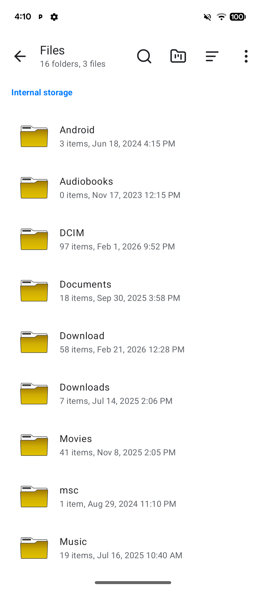</td>
    <td>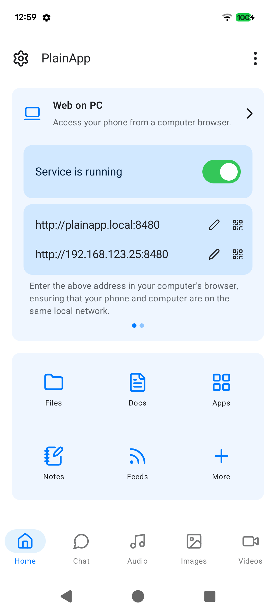</td>
    <td></td>
    <td>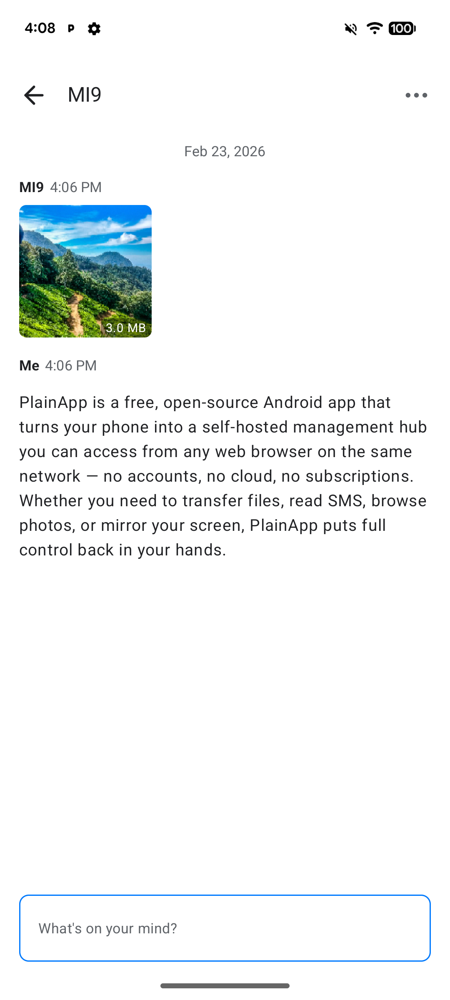</td>
  </tr>
  <tr>
    <td>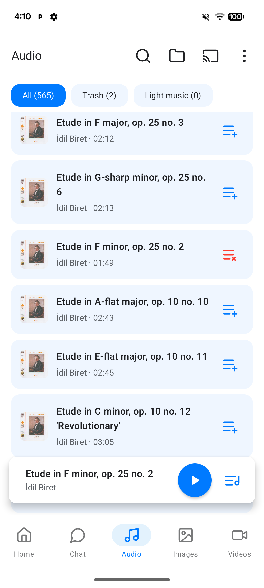</td>
    <td></td>
    <td></td>
    <td></td>
  </tr>
</table>

### Web Dashboard

<table>
  <tr>
    <td colspan="2">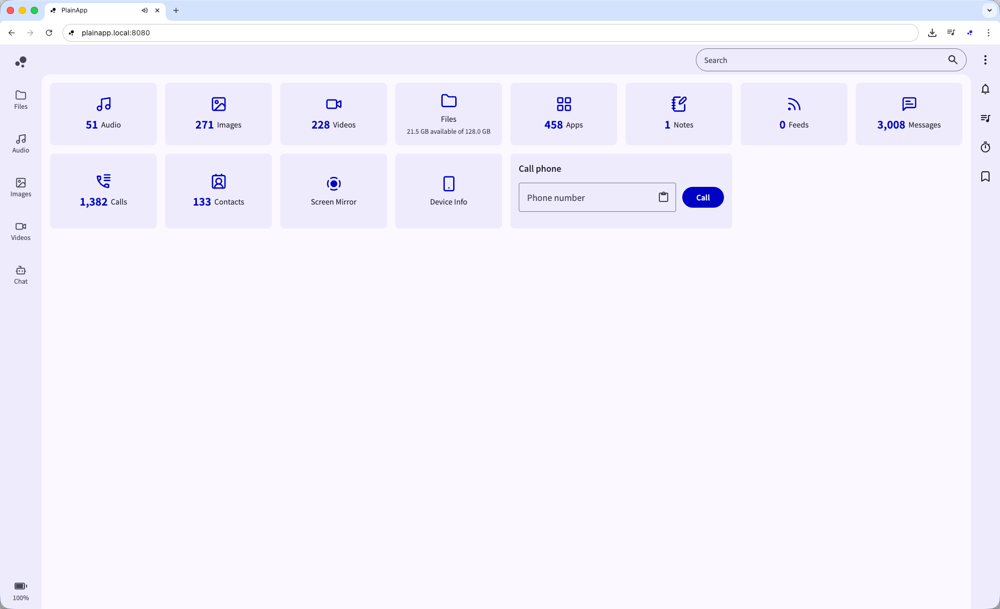</td>
    <td colspan="2"></td>
  </tr>
  <tr>
    <td colspan="2"></td>
    <td colspan="2"></td>
  </tr>
  <tr>
    <td colspan="2">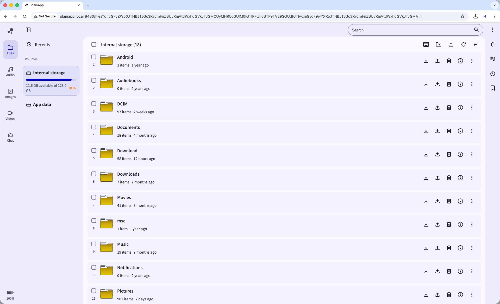</td>
    <td colspan="2"></td>
  </tr>
  <tr>
    <td colspan="2">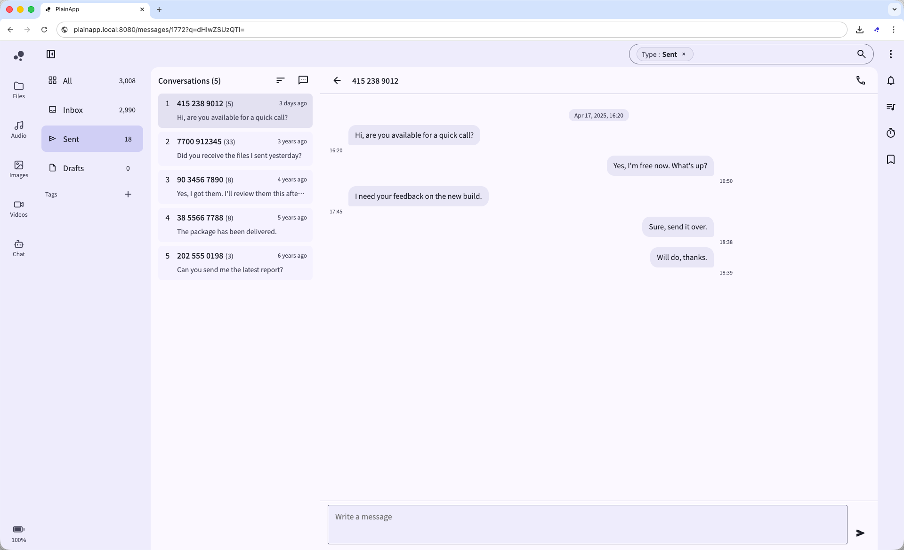</td>
    <td colspan="2"></td>
  </tr>
  <tr>
    <td colspan="2">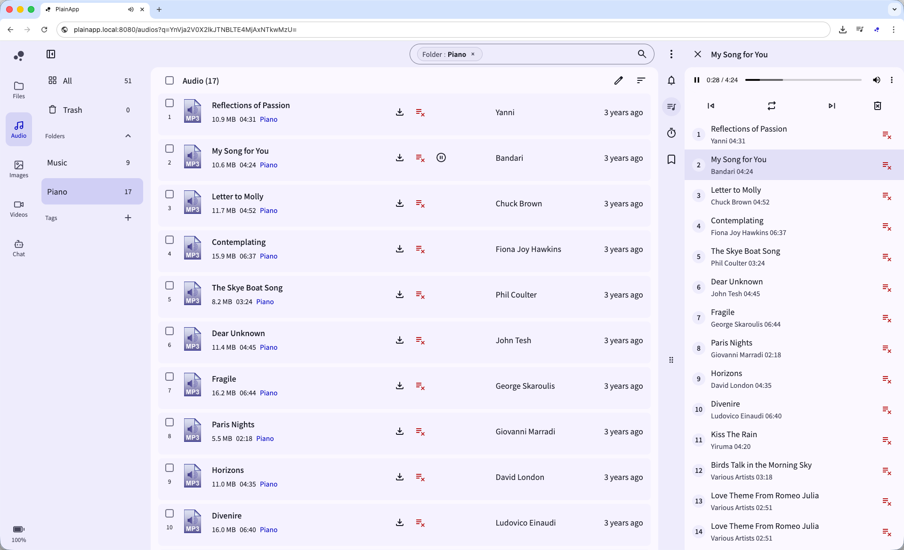</td>
    <td colspan="2">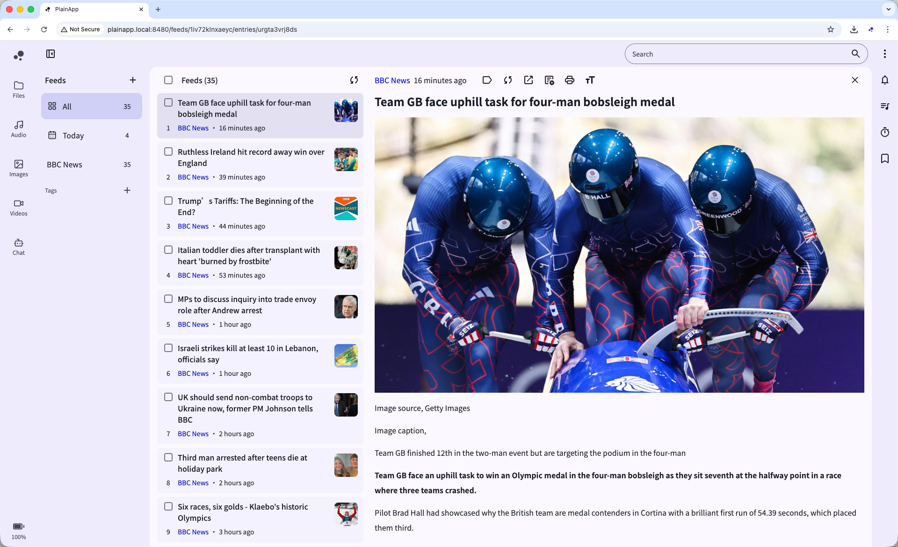</td>
  </tr>
  <tr>
    <td colspan="2"></td>
    <td colspan="2">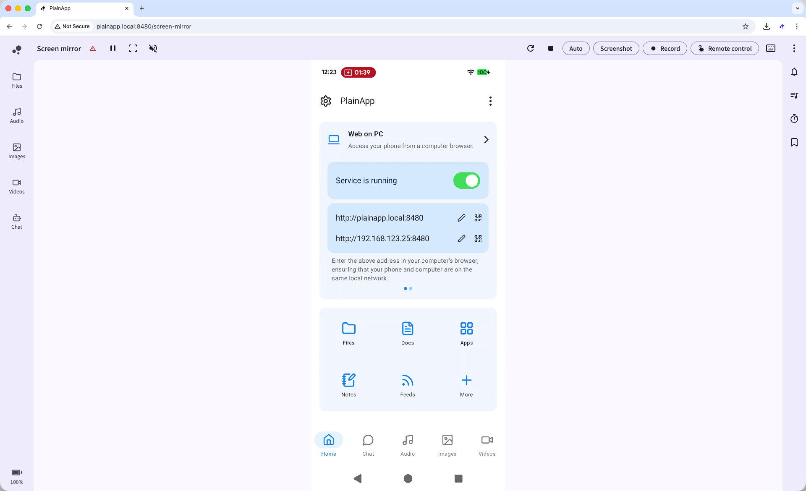</td>
  </tr>
  <tr>
    <td colspan="2"></td>
    <td colspan="2"></td>
  </tr>
  <tr>
    <td colspan="2">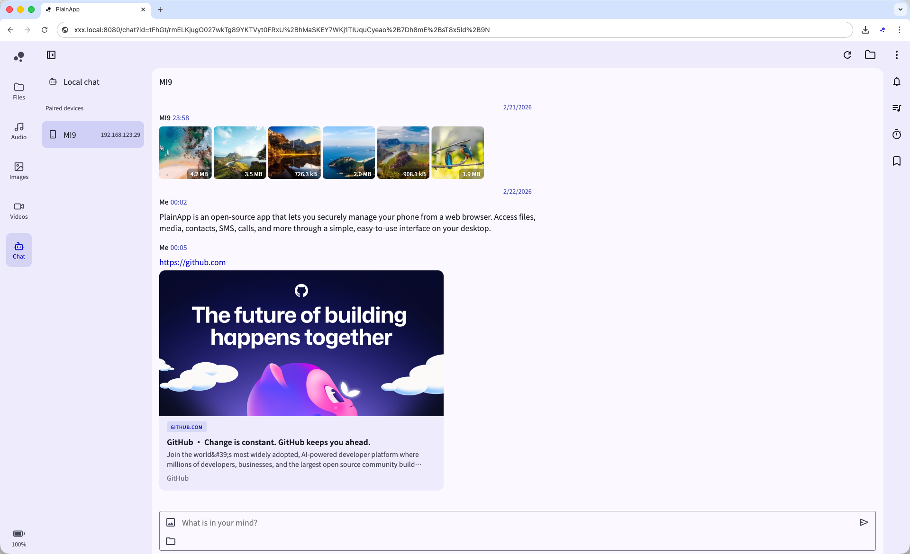</td>
    <td colspan="2"></td>
  </tr>
</table>

## Compatibility

PlainApp requires Android 9.0 or higher.

## FAQ

[http://docs.plain.icu/faq.html](http://docs.plain.icu/faq.html)

## Support

PlainApp is fully open-source.  
If you have any doubts, you're free to review the code, build your own version, or simply choose not to use it.

If you run into issues, feel free to open a GitHub issue — I'm always happy to help.

Please don’t leave a one-star review without giving it a fair try.

## Build

1. Generate `release.jks` file under `$rootProject/app` folder.

```bash
keytool -genkey -v -keystore ./app/release.jks -keyalg RSA -keysize 2048 -validity 10000 -alias plain
```

2. Create `keystore.properties` file with following content under `$rootProject` folder.

```
storePassword=
keyPassword=
keyAlias=plain
storeFile=release.jks
```

## Star history

[](https://star-history.com/#ismartcoding/plain-app&Date)


